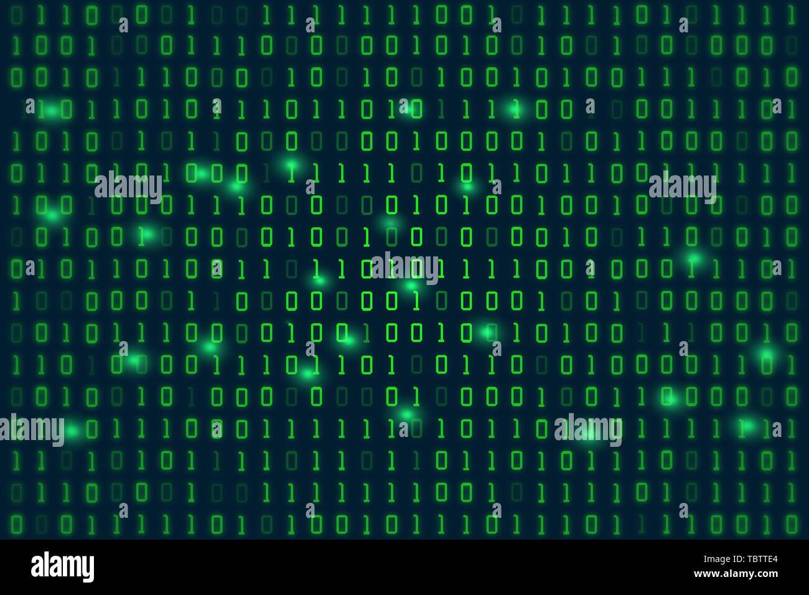

# BinaryTutorial
##### This is the home page for the Digital Systems Final Project. in this repository contains a tutorial for how to read and convert binary numbers.
---
## Consider how we read decimal number system
In order to read binary, it is important to consider how we read docimal which is the number system that we use every day. decimal is base 10 and uses 10 different values, which means that each digit is multipled by 10 to the power of whatever place it is in starting with zero. This may be confusing at first but lets use an example to better explain this concept.
#### Example
* lets use the decimal number 234
    * First digit
        * 4 * (10^0) = `4`
    * Second digit
        * 3 * (10^1) = `30`
    * Third  digit
        * 2 * (10^2) = `200`
    * Finally, we add up the numbers
        * `4 + 30 + 200 = 234`
  
###### This may seem redundant, but it will help when trying to read binary.
---
## Converting Binary to decimal
Binary is considered base 2 which means that there are 2 values (0 and 1) and each digit is multiplied by 2 to the power of whatever place the number is. lets use an example
#### Example
* lets use the binary value 1010
    * First digit
        * 0 * (2^0) = `0`
    * Second digit
        * 1 * (2^1) = `2`
    * Third digit
        * 0 * (2^2) = `0`
    * Fourth digit
        * 1 * (2^3) = `8`
    * Finally, we add up the numbers
        * `0 + 2 + 0 + 8 = 10`
  
###### This example shows that the binary value 1010 is equivalent to the decimal value 10
---
## Converting Decimal to Binary
Now that we know how to convert binary to decimal, I will go over how to convert decimal to binary
#### Example
First, let's consider the binary place values:
| place | multiplier | decimal |
| ----- | ---------- | ------- |
| 1     | 2^0        | 1       |
| 2     | 2^1        | 2       |
| 3     | 2^2        | 4       |
| 4     | 2^3        | 8       |
| 5     | 2^4        | 16      |
| 6     | 2^5        | 32      |
| 7     | 2^6        | 64      |
| 8     | 2^7        | 128     |
* Let's convert the decimal value 115 to binary
    * The first step is to determine what the most significant value you can use in binary, we know we cant have a 1 in the 8th place because that number is too big, but we can put a 1 in the 7s value
        * 0100 0000 = 64
    * Now we continue down the list until the values add up to your decimal value
        * 64 + 32 = 94
            * 0110 0000 = 94
        * 94 + 16 = 110
            * 0111 0000 = 110
        * we cant have a 1 in the 4th place because it will go over 115, so we move on to the next number
        * 110 + 4 = 114
            * 0111 0100 = 114
        * Now we just need one more value, so we put a 1 in the 1s place
            * 114 + 1 = 115
            * 0111 0101 = 115
  
###### In this exampel we used a step by step process to convert the decimal value 115 to binary (0111 0101) 
---
## Conclusion
In this file, we learned how to read binary, how to convert binary to decimal, and how to convert decimal to binary. Hopefully the next time you see a string of ones and zeros you can figure out what they mean instead of thinking to yourself that it is just a bunch of matrix gobbledygook.  

